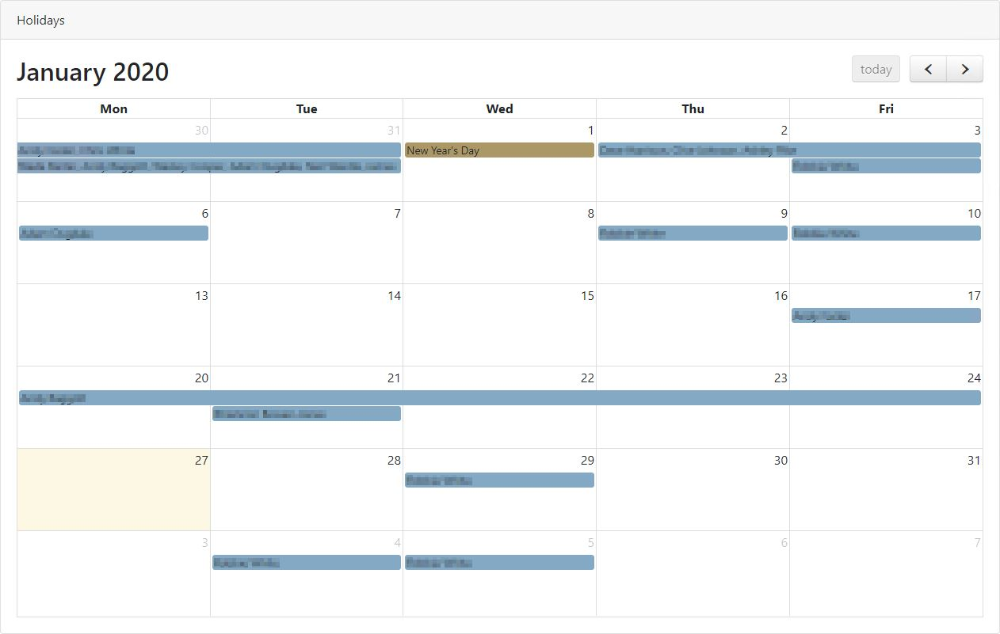

# Timetastic-calendar
 FullCalendar.io with holiday data pulled from Timetastic

A very simple full screen monthly calendar view with details of employees holidays being pulled from Timetastic through their API.

  

Any contributions welcome! :-)